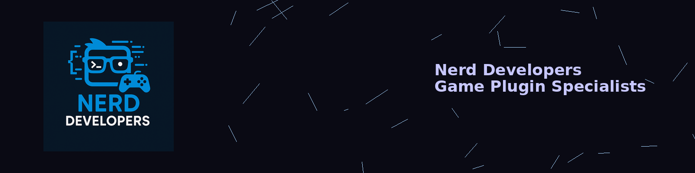

# 🧠 REPO NERD Modpack

**The Modpack Made for Large Parties!**  
A community-focused R.E.P.O. modpack crafted for chaotic fun, rich customization, and compatibility with other mods or modpacks.

---

## 📦 Version

**Current Version:** `1.3.7`  
🛠 *Still maintained and regularly updated!*

---

## 🚀 Installation Instructions

To install the REPO NERD Modpack:

1. Download and install **[r2modman](https://thunderstore.io/package/ebkr/r2modman/)** or visit **[Thunderstore.io](https://thunderstore.io/)**.
2. Open r2modman and:
   - Click **"Create New"** to make a profile (you can name it anything).
   - Or select an existing profile you'd like to use.
3. Navigate to the **Online** tab.
4. Search for **REPO NERD** and click **Download**.
5. Click **Start Modded** at the top to launch the game with the modpack.

> 💡 Encounter issues? Check the guides built into r2modman or Thunderstore!

---

## 🧩 Included Mods

This modpack currently includes the following:

- `BepInEx-BepInExPack` – Core modding framework  
- `Rebateman-LateJoin` – Join games already in progress  
- `Traktool-SharedUpgrades` – Share upgrade benefits  
- `Spindles-MorePlayersImproved` – Expand max players  
- `Cronchy-DeathHeadHopper` – Hopper death variant  
- `flipf17-DeadTTS` – TTS support for deaths  
- `Snowlance-NoDamageInShop` – Shop damage prevention  
- `nickklmao-REPOConfig` – Config management  
- `nickklmao-MenuLib` – UI toolkit for REPO  
- `ebkr-r2modman` – Thunderstore mod manager  
- `PandaSquad-BetterSprint` – Improved sprinting  
- `BULLETBOT-MoreUpgrades` – More upgrade variety  
- `LeviMods-HiddenManDiddy` – Adds mysterious entity  
- `loaforc-loaforcsSoundAPI` – Sound API  
- `loaforc-loaforcsSoundAPI_REPO` – REPO compatibility layer  
- `YMC_MHZ-MoreHead` – Extra enemy variants  
- `Zehs-LethalCompanyValuables` – Loot system enhancements  
- `Lazarus-BetterTruckHeals` – Improved healing  
- `Bengimi-BensCosmetics` – Cosmetic mod  
- `RESET-MoreHeadPlus` – MoreHead expansions  
- `Maygik-MoreHeadUtilities` – Utility extensions  
- `Zehs-REPOLib` – REPO modding library

---

## 🔄 Compatibility

✅ 100% compatible with other R.E.P.O. mods and modpacks!  
Customize to your liking by adding or removing mods!

---

## 📝 Changelog

> *Sample log – update this section with new releases*

- **v1.3.7** – Added `BetterTruckHeals` and updated `MoreHead` to v1.4.1  
- **v1.3.6** – Minor compatibility improvements  
- **v1.3.5** – First release on Thunderstore

---

## 👥 Ideal For

- Large co-op teams
- Modded chaos
- Nerdy mayhem

---

## 👤 Created by Nerd Developers

Created by the **Nerd Developers** team for the REPO community.  
Check us out on [GitHub](https://github.com/DyslexicNerd01) or the [Thunderstore page](https://thunderstore.io/c/repo/p/NerdsDev/REPO_NERD/).

---

> 🎮 Play smart. Play weird. Play NERD. 🧠

